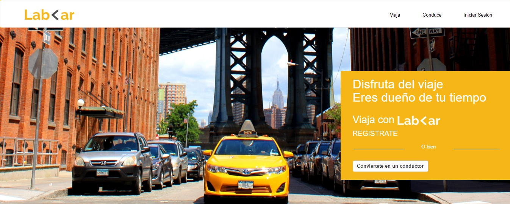
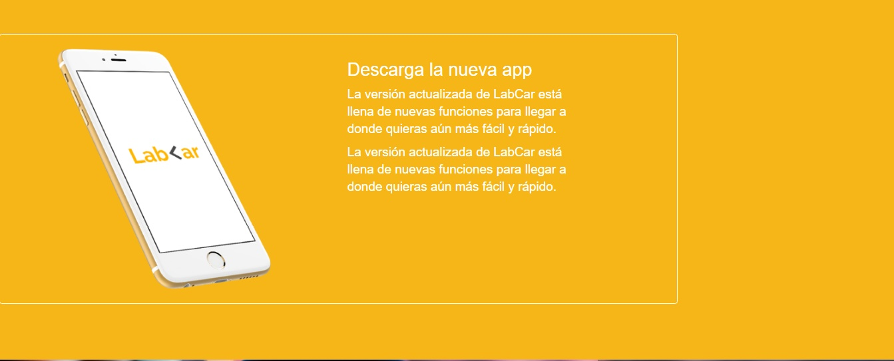
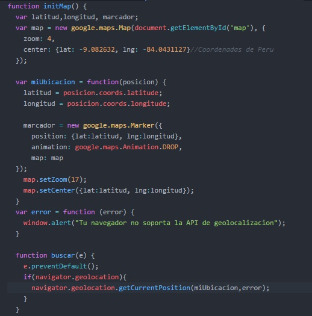
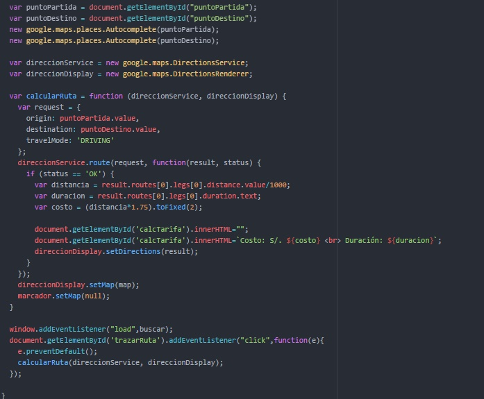
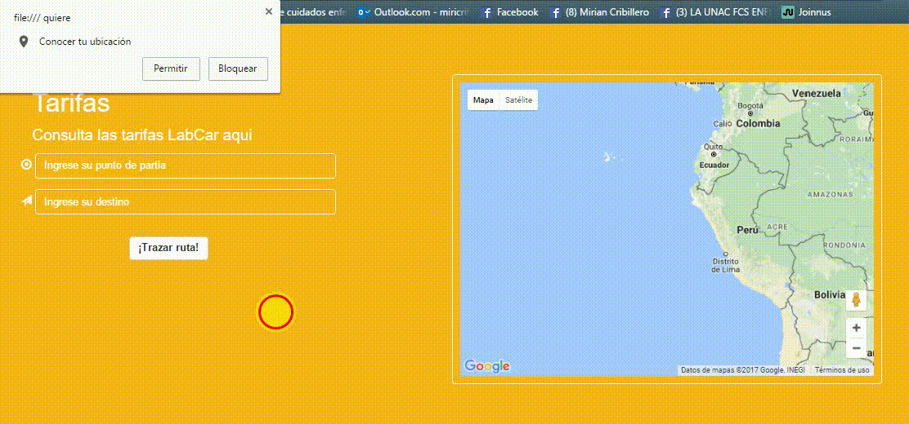
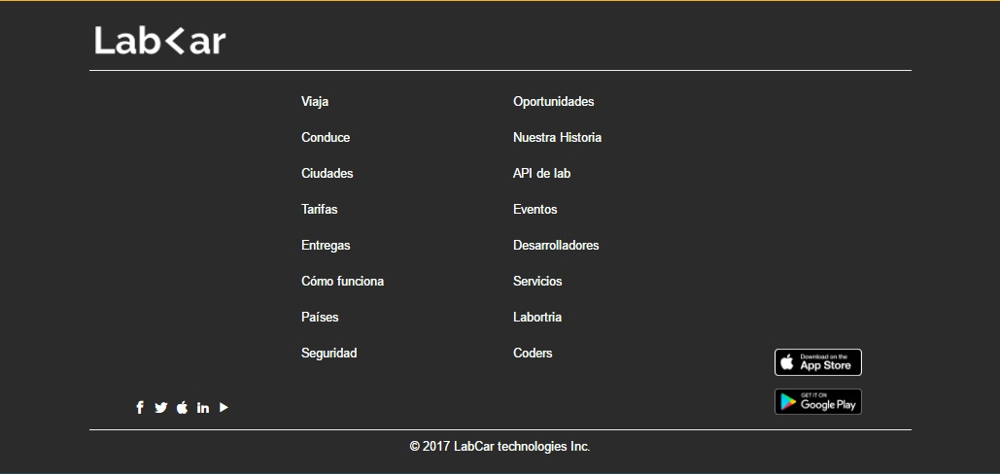

# LabCar | Servicio de Taxi

## El proyecto
Se realizó un code review del:
Proyecto final del Sprint4 del Bootcamp de Laboratoria < l >

- El proyecto se baso en hacer una página web que ofrece el servicio de taxi, dar la ubicación actual del usuario y le permite colocar de que punto a que punto se dirige, además da la tarifa.
- En el proyecto se uso Bootstrap.

## LabCar: contenido

### Nav-Hero
El nav en la versión mobile aparece como una menú tipo hamburguesa. 

En la versión desktop se visualiza así: 

### Información
En esta sección tenemos una maquetado que utiliza clases de bootstrap como thumbnail entre otras 

### Conduce
Aquí se aplican conocimientos previos como hacer un background con color en rgba entre otros recursos 

### Tarifa
En esta sección aparecerá el mapa con nuestra ubicación, al permitirle al navegador que acceda a nuestros datos, para lo cual empleamos el Api de HTML5 y el Api de Google Maps 
- Para usar el Api de Google Maps necesitamos colocar este script en nuestro html (En este script hay que colocar nuestra key, generada en https://developers.google.com/maps/documentation/javascript/places?hl=es-419#place_searches):   

- Para trazar la ruta se hace uso de los recursos de la Api de Google Maps: 

- Para trazar la ruta como hemos visto en la función anterior se hizo uso de los objetos que nos proporciona esta api: google.maps.DirectionsService, el cual se encarga de obtener las coordenadas y con que medio te movilizas para indicarte las inflexiones;
google.maps.DirectionsRenderer, que en términos simples se encargará de traducir la ruta y plasmarlo por medio de líneas. Veamos como funciona:  

### Footer
Tiene varios links, se uso flexbox y el grid de bootstrap  

## Versión Mobile

## Desarrollado con:

`HTML` `JavaScript` `CSS` `BOOTSTRAP` `APIs`  

##  Créditos
* [Miriam Peralta](https://github.com/miriampc)
* [Betsi Loayza](https://github.com/betsiana)
* [Marilu LLamocca](https://github.com/Maryleo3007)
* [Lourdes Vilchez](https://github.com/lulublondet)
* [Maricarmen Rojas](https://github.com/maiart46rrrrrrr)
* [Stephanie Hiyagon](https://github.com/stephHiyagon)
